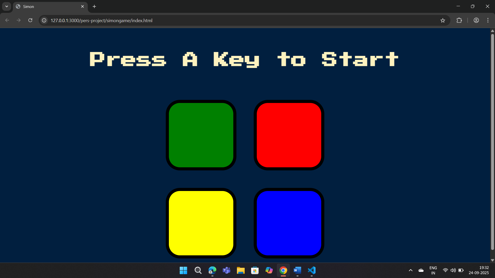

# Simon Game 🎮

An interactive **memory-based game** built using **HTML, CSS, and JavaScript**.  
The player must repeat an increasing sequence of colors and sounds. Each correct sequence advances the level.

---

## 🚀 Features
- Randomly generated color patterns.
- Levels increase difficulty dynamically.
- Uses **DOM manipulation** and **event listeners**.
- Sound effects and animations for engaging gameplay.
- Responsive design for smooth play on desktop and mobile.

---

## 🛠️ Tech Stack
- HTML  
- CSS  
- JavaScript (DOM Manipulation, Event Listeners, Game Logic)

---

## 📸 Demo
<!-- Upload a screenshot of your game here -->


🔗 **Live Demo:** [Click here](https://mohamednoordeen22.github.io/simon-game-js/)

---

## 📂 How to Run Locally
```bash
git clone https://github.com/mohamednoordeen22/simon-game-js.git
cd simon-game-js
open index.html
